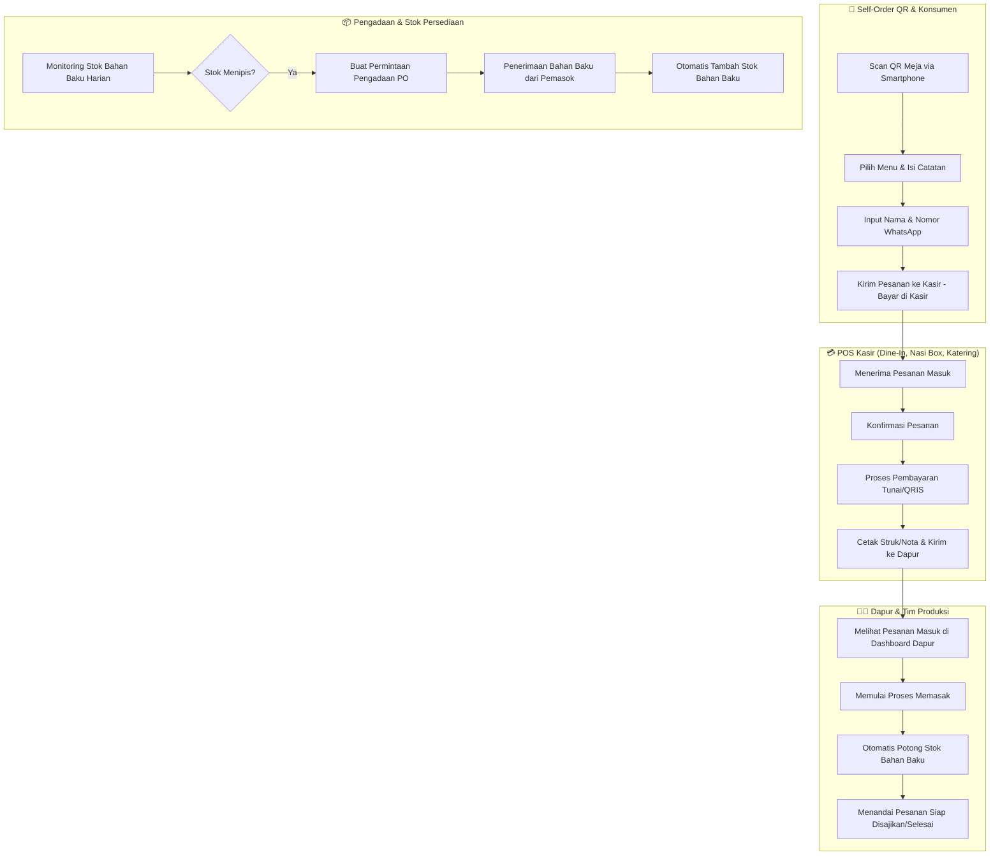
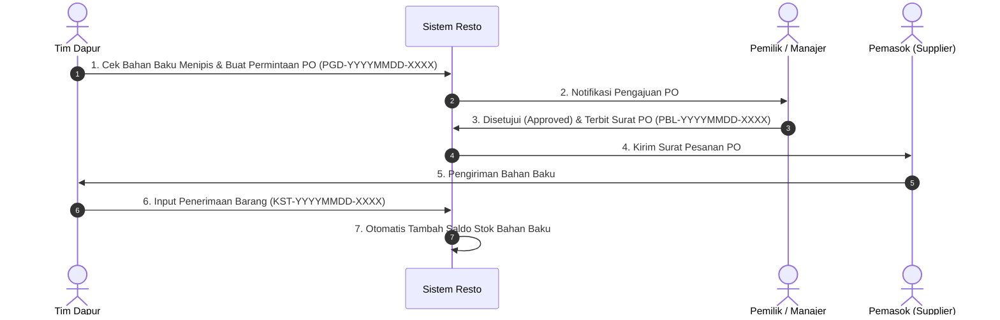

# 📋 DOCUMENTASI ALUR OPERASIONAL SISTEM RESTORAN
**RM Saung Babakan Cinta**

---

## 📐 DIAGRAM ALUR UTAMA SISTEM (OVERVIEW)

---

## 1. 🍽️ ALUR PENJUALAN DINE-IN & SELF-ORDER QR

### **A. Jalur Pelanggan (Self-Order QR via HP)**
1. **Pindai QR Code Meja**: Pelanggan memindai QR Code di meja makan (menggunakan koneksi Wi-Fi LAN / IP Server).
2. **Pilih Menu & Catatan**: Memilih varian menu Dine-In (Makanan, Minuman, Paket), mengatur jumlah porsi, serta menambahkan catatan khusus per item.
3. **Input Identitas Pelanggan**: Mengisi Nama Konsumen dan Nomor WhatsApp.
4. **Ringkasan Tagihan & Komponen Biaya**:
   - **Subtotal Item**: Diperhitungkan transparan dari `Jumlah Porsi × Harga Satuan` (`@ Rp XX.XXX / porsi`).
   - **Biaya Layanan**: Biaya layanan flat per transaksi / struk (**Rp 1.000 / Struk**).
   - **Pajak / PPN**: *Dieliminasi secara total (0%)*.
   - **Total Tagihan**: `Subtotal Item + Biaya Layanan`.
5. **Kirim Pesanan**: Pesanan terkirim ke sistem POS Kasir dengan metode pembayaran **Bayar di Kasir**.

### **B. Jalur Kasir POS**
1. **Penerimaan Pesanan**: Kasir melihat pesanan masuk di daftar *Open Bills* / Meja Terisi.
2. **Detail & Checkout**: Kasir mengonfirmasi rincian menu per porsi (`5x Nasi Liwet Ayam Kampung Bakar Penyet @ Rp 35.000 / porsi = Rp 175.000`).
3. **Pembayaran**: Kasir memproses pembayaran **Tunai** (dengan fitur kalkulasi kembalian otomatis & kalkulator cepat) atau **QRIS**.
4. **Cetak & Finalisasi**: Sistem menerbitkan ID Transaksi Standar (`DIN-YYYYMMDD-XXXX`), mencetak struk nota, dan meneruskan tiket pesanan ke Tim Dapur.

---

## 2. 🍱 ALUR PENJUALAN NASI BOX & KATERING

1. **Input Pesanan Pelanggan**: Kasir / Manajer menginput pesanan Nasi Box / Katering dengan menyertakan:
   - Tanggal & Waktu Pengiriman.
   - Alamat Tujuan & Jarak Pengiriman (Km).
   - Pilihan Menu Paket & Jumlah Porsi.
2. **Kalkulasi Biaya Pengiriman (Ongkir)**:
   - Sistem memeriksa **Tier Gratis Ongkir** berdasarkan total porsi (contoh: $\ge 50$ porsi gratis 10 Km).
   - Jarak berbayar dihitung: `(Total Jarak - Jarak Gratis) × Tarif per Km`.
3. **DP / Pelunasan**: Pelanggan membayar Uang Muka (DP) atau Pelunasan. Pesanan diteruskan ke Tim Produksi Dapur.

---

## 3. 👨‍🍳 ALUR DAPUR & TIM PRODUKSI (ROLE: DAPUR / TIM DAPUR)

1. **Dashboard Dapur**: Tim Dapur memantau pesanan masuk secara *real-time* berdasarkan 3 kategori:
   - **Pesanan Dine-In** (`/admin/pesanan/dinein`)
   - **Pesanan Nasi Box** (`/admin/pesanan/nasi-box`)
   - **Pesanan Katering** (`/admin/pesanan/catering`)
2. **Proses Memasak**: Dapur menekan tombol **Memulai Memasak**.
3. **Pengurangan Stok Otomatis**: Sistem secara otomatis mengonversi resep menu dan memotong **Stok Bahan Baku Harian / Katering** berdasarkan jumlah porsi yang dimasak.
4. **Siap Saji**: Setelah selesai dimasak, status diubah menjadi **Siap Disajikan / Selesai**.

---

## 4. 📦 ALUR PERSEDIAAN (STOK HARIAN & KATERING)

1. **Stok Harian (`/persediaan/stok-operasional`)**: Monitoring saldo stok bahan baku untuk operasional Dine-In & Nasi Box.
2. **Stok Katering (`/persediaan/stok-catering`)**: Isolasi stok khusus pesanan katering skala besar.
3. **Format Satuan Standar**:
   - Bahan ditakar dalam satuan dasar (`gram`, `ml`, `pcs`).
   - Tampilan visual otomatis dikonversi: $\ge 1.000\text{ gram} \rightarrow \mathbf{1,5\text{ kg}}$, $\ge 1.000\text{ ml} \rightarrow \mathbf{2\text{ liter}}$.
4. **Penyesuaian Stok**: Melakukan *Stock Opname* jika terdapat bahan rusak/expired.

---

## 5. 🛍️ ALUR PENGADAAN BAHAN BAKU (PURCHASE ORDER & PENERIMAAN)

---

## 6. ⚙️ ALUR PENGATURAN PEMILIK (BIAYA LAYANAN & TARIF PENGIRIMAN)

1. **Biaya Layanan (`/admin/pengaturan/transaksi`)**:
   - Menetapkan Biaya Layanan Flat per Struk (Contoh: **Rp 1.000 / Transaksi**).
   - Pajak / PPN dinonaktifkan secara total.
   - Histori perubahan tercatat pada tabel **Riwayat Perubahan**.
2. **Tarif Pengiriman (`/admin/pengaturan/pengiriman`)**:
   - Menentukan Tarif Dasar (Flat) & Tarif Tambahan per Km (Rp 2.500/km).
   - **Tingkatan Gratis Ongkir**:
     - *Tier 1 (20–49 porsi)*: Gratis 5 Km
     - *Tier 2 (50–99 porsi)*: Gratis 10 Km
     - *Tier 3 ($\ge$ 100 porsi)*: Gratis 20 Km / Full Ongkir
